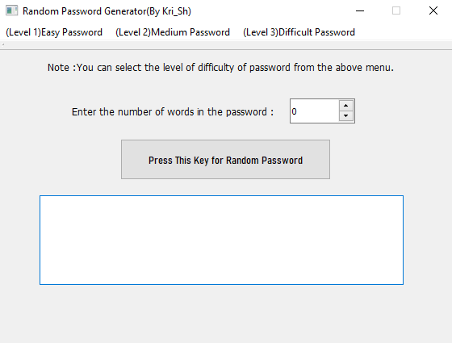

# Random-Password-Generator
&nbsp;
## [](https://github.com/kritika-srivastava/Random-Password-Generator/blob/master/LICENSE)[](https://www.repostatus.org/#active)
## 
#### *Welcome to Random Password Generation’s documentation! Here I shall give an overview of all the things you need to know to get started with this project.*
&nbsp;


&nbsp;

&nbsp;

*This project demonstrates a simple basic password generator with randomized passwords of varying length and type.*
&nbsp;


## Technical Stack
###### -PyQt5
###### -Qt Designer
###### -Anaconda
###### -Python Libraries
        - Random
        - String

&nbsp;


## Functions
#### *You can generate the following types of passwords:*
##### -Small Alphabets
##### -Capital Alphabets
##### -Mixed Alphabets
##### -Numbers
##### -Alphabets and Numbers
##### -Alphabets Numbers and Symbols
&nbsp;

You can get the source code at my [Github Page](https://github.com/kritika-srivastava/Random-Password-Generator)
&nbsp;

Although I have specified the maximum limit of words in the QtDesigner SpinBox as 300, you can change the value by opening the [UI file](https://github.com/kritika-srivastava/Random-Password-Generator/blob/master/MainWindow.ui) in the QtDesigner.
&nbsp;

As of now, this project runs on Python 3.x . Make sure that PyQt5 should be installed in any of your python distributions. To start the program with the GUI (assuming all dependencies installed) run the GUI.py file.
If everything worked so far, the GUI should open up and look like this:
&nbsp;


&nbsp;
  
In order to compile the file in an executable, open anaconda prompt and change the directory to the one that contains GUI.py file. Now type the following command :
``` 
pyinstaller.exe -y -F --distpath="." GUI.py
``` 
The precompiled exe file can be found in the release section of this repository.
&nbsp;

## References
#### -[GUI Application Detailed tutorial](https://www.learnpyqt.com/examples/simple-sales-tax-calculator/)
#### -[PyQt5 Menubar Tutorial](https://techwithtim.net/tutorials/pyqt5-tutorial/menubar/)


